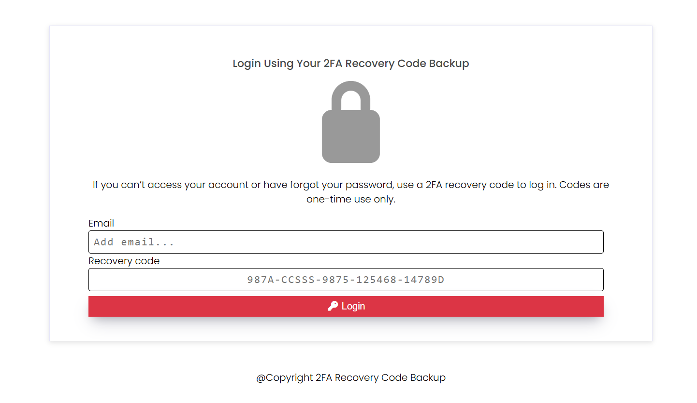

## Quickstart and Walkthrough

### Setup
---

This guide shows you how to set up a fresh Django project and integrate **2FA Recovery Codes** using the `django_auth_recovery_codes` package.  

The walkthrough assumes you don’t already have a Django project, which is why we create a new one called `test_project`.  

If you already have an existing Django project, skip to Existing project :

- then follow the steps in this guide that apply to integration (skipping project creation).

---

### Installation (with Virtual Environment)

### 1. Create a virtual environment

```bash
python -m venv env
````

* `env` is the folder name for your virtual environment. You can name it anything.

### 2. Activate the virtual environment

* **Windows (PowerShell)**

  ```powershell
  .\env\Scripts\Activate.ps1
  ```
* **Windows (CMD)**

  ```cmd
  .\env\Scripts\activate.bat
  ```
* **macOS/Linux**

  ```bash
  source env/bin/activate
  ```

### 3. Upgrade pip (optional but recommended)

```bash
pip install --upgrade pip
```

### 4. Install Django (latest version)

```bash
pip install django
```

### 5. Install the recovery codes package

```bash
pip install django_auth_recovery_codes
```

### 6. Verify installation

```bash
python -m django --version
pip show django_auth_recovery_codes
```

---

## Project Setup

### 7. Create a new Django project

```bash
django-admin startproject test_project
cd test_project
```

### 8. Run initial migrations

```bash
python manage.py migrate
```

### 9. Create a Django superuser

```bash
python manage.py createsuperuser
```

* Follow the prompts to set username, email, and password.

### 10. Start a new app called `home`

```bash
python manage.py startapp home
```

### 11. Add `home`, `django_auth_recovery_codes`, and `django_q` to `INSTALLED_APPS`

Edit `test_project/settings.py`:

```python
INSTALLED_APPS = [
    ...,

    # third-party apps
    "django_auth_recovery_codes",
    "django_q",

    # your app
    "home",
]
```


### 12. Run the development server

```bash
python manage.py runserver
```

Open [http://127.0.0.1:8000/admin](http://127.0.0.1:8000/admin) and log in with your superuser credentials.

---

## Configure URLs

### 13. In `home/urls.py`

Create the file if it doesn’t exist:

```python
from django.urls import path
from . import views

urlpatterns = [
    path("", view=views.home, name="home"),
]
```

### 14. In your **main** `urls.py` (same folder as `settings.py`)

```python
from django.contrib import admin
from django.urls import path, include

urlpatterns = [
    path("admin/", admin.site.urls),
    path("", include("django_auth_recovery_codes.urls")),  # recovery codes
    path("", include("home.urls")),  # home app
]
```

---

### Configure your Settings.py file

### 15. Add the recovery code settings flags in your `settings.py` file

```python

# Required values, customise for your project
DJANGO_AUTH_RECOVERY_CODE_ADMIN_EMAIL = "your-email-address"
DJANGO_AUTH_RECOVERY_CODE_ADMIN_EMAIL_HOST_USER = "main-smtp-email"
DJANGO_AUTH_RECOVERY_CODE_ADMIN_USERNAME = "username"
DJANGO_AUTH_RECOVERY_KEY = "add-some-key"
DJANGO_AUTH_RECOVERY_CODES_SITE_NAME="some site name"


# Default values (can be left as-is or overridden)
DJANGO_AUTH_RECOVERY_CODE_AUDIT_ENABLE_AUTO_CLEANUP = 30
DJANGO_AUTH_RECOVERY_CODE_AUDIT_RETENTION_DAYS = 30
DJANGO_AUTH_RECOVERY_CODE_MAX_VISIBLE = 20
DJANGO_AUTH_RECOVERY_CODE_PER_PAGE = 5
DJANGO_AUTH_RECOVERY_CODE_PURGE_DELETE_RETENTION_DAYS = 30
DJANGO_AUTH_RECOVERY_CODE_PURGE_DELETE_SCHEDULER_USE_LOGGER = True
DJANGO_AUTH_RECOVERY_CODE_REDIRECT_VIEW_AFTER_LOGOUT = "login_user"
DJANGO_AUTH_RECOVERY_CODE_STORE_EMAIL_LOG = True
DJANGO_AUTH_RECOVERY_CODES_AUTH_RATE_LIMITER_USE_CACHE = True
DJANGO_AUTH_RECOVERY_CODES_BASE_COOLDOWN = 3600
DJANGO_AUTH_RECOVERY_CODES_BATCH_DELETE_SIZE = 1000
DJANGO_AUTH_RECOVERY_CODES_CACHE_MAX = 3600
DJANGO_AUTH_RECOVERY_CODES_CACHE_MIN = 0
DJANGO_AUTH_RECOVERY_CODES_CACHE_TTL = 300
DJANGO_AUTH_RECOVERY_CODES_COOLDOWN_CUTOFF_POINT = 3600
DJANGO_AUTH_RECOVERY_CODES_COOLDOWN_MULTIPLIER = 2
DJANGO_AUTH_RECOVERY_CODES_DEFAULT_FILE_NAME = "recovery_codes"
DJANGO_AUTH_RECOVERY_CODES_DEFAULT_FORMAT = "txt"
DJANGO_AUTH_RECOVERY_CODES_MAX_LOGIN_ATTEMPTS = 3
DJANGO_AUTH_RECOVERY_CODES_MAX_DELETIONS_PER_RUN = -1
```

### Add a Q_CLUSTER 
See 

For now we use the default

```


Q_CLUSTER = {
    'name': 'recovery_codes',
    'workers': 2,
    'timeout': 300,   # 5 minutes max per task
    'retry': 600,     # retry after 10 minutes if task fails (retry must be greater than timeout)
    'recycle': 500,
    'compress': True,
    'cpu_affinity': 1,
    'save_limit': 250,
    'queue_limit': 500,
    'orm': 'default',
}

```


### 16.Set up the file-based email backend (for testing)

This will create a `sent_emails` folder where Django saves emails instead of sending them.

```python
EMAIL_BACKEND = "django.core.mail.backends.filebased.EmailBackend"
EMAIL_FILE_PATH = BASE_DIR / "sent_emails"
```

### 17. Run the system checks

Stop the server (`Ctrl+C`) if it’s running, then run:

```bash
python manage.py check
```

This will raise errors if any settings are misconfigured (e.g., wrong data types).

---

### 17a. Generate a recovery code 

Run the follwoing command, make sure your virtual environment is active.
This will drop you into shell but load all app modules

```python

python manage.py shell

```
Next run

```python

from django_auth_recovery_codes.utils.security.generator  import generate_secure_token

# This will generate a secure cryptographically key which can use for your recovery key in the settings flag
# code_length = 10, default this will generate a secret key that is 100 characters, adjust length as you see fit
generate_secure_token(code_length=10)

```

Copy the key into your recovery key

```
DJANGO_AUTH_RECOVERY_KEY = 

```


### Run Services

### 18. Open two terminals

**Terminal 1** – run the server:

```bash
python manage.py runserver
```

**Terminal 2** – run django-q cluster:

```bash
python manage.py qcluster
```

---
### Create a Home View

#### 19. In `home/views.py`

```python
from django.http import HttpResponse

def home(request):
    return HttpResponse("This is the home page")
```

---

### Verify the Home Page

Open your browser and go to:

```
http://127.0.0.1:8000/
```

You should see:
*"This is the home page"*

---

markdown
### Access the Admin

Since we don’t have a login portal yet, log in via the admin:

```

http://127.0.0.1:8000/admin/

```

* Enter the superuser credentials you created with `createsuperuser`.

---

### Access the Recovery Codes page dashboard

Once logged in, go to the dashboard via:

```

http://127.0.0.1:8000/auth/recovery-codes/dashboard/

```

---

### Code Generation

##### Choose whether the code should have an expiry date

<div align="center">
  
</div>

---

### Once the code is generated

* You should see something that looks like this:

<div align="center">
  
</div>

* From here, you can regenerate, email, download, or delete the code.

---


### Verifying Generated Codes

* Once the codes are generated, you have the option to verify if the setup is correct.  
* This is a one-time verification test, and the form will remain until it is verified.  
* Once verified, it will no longer appear, even on a new batch generation.  
* To use, simply select a code and enter it in the form.

<div align="center">
  
</div>

#### Failed Test

* A failed test will look like this:

<div align="center">
  
</div>

#### Successful Test

* A successful test will look like this.  
* Once the test is successful, the form will no longer be visible.

<div align="center">
  
</div>

---

### Downloaded and Emailed Code

* Once a code is downloaded or emailed, it cannot be used again for the same batch.

<div align="center">
  
</div>

---

### Invalidating or Deleting a Code

* The application allows you to invalidate or delete a code.  
* Once a code has been invalidated or deleted, it cannot be used again.  

<div align="center">
  
</div>

---

### Viewing the Code Batch History

* You can view your code history.  
* It contains information about the generated code batch, such as the number issued and whether the codes were downloaded or emailed.  

<div align="center">
  
</div>

---


### Logout of the application

Now click the `logout` but before you do make sure to download a copy of the recovery codes, you will need this to login.
Once you logout you be redirect to the default login page, see the flag settings to see how to redirect to another page .

* You will no longer be able to access the dashboard since it is login only
* You can verify this by going to the home page

```
http://127.0.0.1:8000

```

---

### Failed Attempts and Rate Limiting

**Login Form**

<div align="center">
  
</div>

**Failed Attempt Example**

* Failed login attempts are limited by the flag `DJANGO_AUTH_RECOVERY_CODES_MAX_LOGIN_ATTEMPTS`.  
* In this example, it has been set to `5`.  
* This means that after 5 failed attempts, the rate limiter activates.  
* The cooldown starts at 1 minute and increases with each subsequent failed attempt.  
* It will not exceed the cooldown threshold period (e.g., if set to `3600`, that is 1 hour).  


<div align="center">
  
</div>

---

### Successful Login

* Enter the email address you used when creating your superuser.  
* Use one of the valid 2FA recovery codes from your downloaded codes.  
* Upon success, you will be redirected to the dashboard.  
* The code you used will automatically be marked as invalid.  


---


### 2. Existing Project Setup

If you already have a Django project running, integration is simple:

1. **Install the package**

   ```bash
   pip install django_auth_recovery_codes
   ```

2. **Update `INSTALLED_APPS` in `settings.py`**

   ```python
   INSTALLED_APPS = [
       ...,
       "django_auth_recovery_codes",
       "django_q",  # required for background jobs
   ]
   ```

3. **Add a recovery key and email backend (for testing)**

   ```python
   EMAIL_BACKEND = "django.core.mail.backends.filebased.EmailBackend"
   EMAIL_FILE_PATH = BASE_DIR / "sent_emails"

   DJANGO_AUTH_RECOVERY_KEY = "add-some-key"
   ```

4. **Include URLs in your main `urls.py`**

   ```python
   from django.urls import path, include

   urlpatterns = [
       ...,
       path("", include("django_auth_recovery_codes.urls")),
   ]
   ```

5. **Run migrations**

   ```bash
   python manage.py migrate
   ```

   > ⚠️ You don’t need to run `makemigrations` for this package because it already ships with its own migrations.
   > Just running `migrate` will apply them.

6. **Start services**

   ```bash
   # Terminal 1
   python manage.py runserver

   # Terminal 2
   python manage.py qcluster
   ```

---
## Scheduling a Code Removal Using Django-Q

In this section, we walk you through how to safely remove recovery codes using Django-Q. You will learn how to generate codes and schedule their deletion, ensuring they are managed automatically and securely. Make sure this running in a separate window

```
  python manage.py qcluster

```

### Generate and Delete Codes

1. Generate your recovery codes.
2. Click the **Delete Codes** button and confirm the action.

> Once confirmed, Django-Q will schedule the codes for deletion. This means the codes will be automatically removed according to the scheduled task, rather than immediately, providing a safe and managed cleanup process.

<div align="center">
  
</div>

---

### Managing Scheduled Deletion via the Admin

Since we are logged in through the admin, we already have administrator access.

1. Open a new tab and navigate to:

   ```
   http://127.0.0.1:8000/admin/
   ```

2. Once there, click on the **Recovery codes** link.

<div align="center">
  
</div>

You will then see the following view:

<div align="center">
  
</div>

Select **Recovery code cleanup schedulers**:

<div align="center">
  
</div>

---

### Scheduling a Delete

<div align="center">
  
</div>

#### Quick Explanation

* **Retention days**: The number of days an expired or invalid code remains in the database before being deleted. For example, if set to 30, a code will be deleted 30 days after it expires. The default is controlled via a settings flag but can be overridden in the admin interface.

  * For testing, set this to `0` to remove codes immediately.

* **Run at**: The time the scheduler should run.

* **Schedule type**: How frequently the scheduler should run (`Once`, `Hourly`, `Daily`, `Weekly`, `Monthly`, `Quarterly`, `Yearly`).

* **Use with logger**: Records the scheduled deletion in a log file.

* **Delete empty batch**: When set to `True`, the parent batch (model) is removed if no active codes remain. When `False`, the batch will be kept.

* **Name**: A descriptive name for the scheduler.

* **Next run**: The next time the scheduler should run. This must not be earlier than the **Run at** value. It can also be left blank.

  * Note: The scheduler is idempotent. Once configured, it will follow the set rules without needing to be triggered manually. The **Next run** option simply allows you to run an additional execution if required.


Save the scheduler


### View tasks

Once Django-q is running you can view failed, queued, tasks via this section

<div align="center">
  
</div>


### Summary

## Scheduling a Code Removal Using Django-Q

In this section, we walk you through how to safely remove recovery codes using Django-Q. You will learn how to generate codes and schedule their deletion, ensuring they are managed automatically and securely.  

---

### Generate and Delete Codes

1. Generate your recovery codes.  
2. Click the **Delete Codes** button and confirm the action.  

> Once confirmed, Django-Q will schedule the codes for deletion. This means the codes will be automatically removed according to the scheduled task, rather than immediately, providing a safe and managed cleanup process.  

<div align="center">
  
</div>

---

### Managing Scheduled Deletion via the Admin

Since we are logged in through the admin, we already have administrator access.  

1. Open a new tab and navigate to:  

```

[http://127.0.0.1:8000/admin/](http://127.0.0.1:8000/admin/)

```

2. Once there, click on the **Recovery codes** link.  

<div align="center">

</div>

You will then see the following view:  

<div align="center">

</div>

Select **Recovery code cleanup schedulers**:  

<div align="center">

</div>

---

### Scheduling a Delete  

<div align="center">

</div>

#### Quick Explanation  

- **Retention days**: The number of days an expired or invalid code remains in the database before being deleted.  
- Example: If set to 30, a code will be deleted 30 days after it expires.  
- Default is set in your Django settings but can be overridden in the admin interface.  
- For testing, set this to `0` to remove codes immediately.  

- **Run at**: The time the scheduler should run.  

- **Schedule type**: How frequently the scheduler should run (`Once`, `Hourly`, `Daily`, `Weekly`, `Monthly`, `Quarterly`, `Yearly`).  

- **Use with logger**: Records the scheduled deletion in a log file.  

- **Delete empty batch**:  
- `True`: Removes the parent batch if no active codes remain.  
- `False`: Keeps the batch even if it is empty.  

- **Name**: A descriptive name for the scheduler.  

- **Next run**: The next time the scheduler should run. This must not be earlier than **Run at**, but can be left blank.  
- Note: The scheduler is idempotent. Once configured, it will follow the set rules without needing to be triggered manually. The **Next run** option simply allows for an additional one-off execution.  

---

## Summary


1. Generate your recovery codes.  
2. Click **Delete Codes** → Django-Q schedules the deletion.  
3. In the **Admin**, open **Recovery code cleanup schedulers**.  
4. Configure:  
- **Retention days** → how long codes stay before deletion (set `0` for immediate removal).  
- **Schedule type** → how often deletion runs.  
- **Run at / Next run** → when to start.  
- **Delete empty batch** → remove batch if no codes remain.  

✅ That’s it. Django-Q will handle the cleanup automatically. Tasks are added to a queue and picked up by workers, so in most cases the cleanup will happen very quickly. Depending on your worker setup and workload, there may be a short delay, but it will always be processed.

---

### Visual Flow

```

Generate recovery codes
│
▼
Click **Delete Codes**
│
▼
Django-Q schedules deletion
│
▼
Go to **Admin → Recovery code cleanup schedulers**
│
▼
Configure scheduler:
• Retention days
• Run at / Next run
• Schedule type
• Delete empty batch
│
▼
✅ Codes are cleaned up automatically

```

You can also run a scheduler to remove the audit reports for `Recovery Code` by using `Recovery code audit schedulers`. The audits are store in the `Recovery code Audit` model. The steps are same as the above steps.


